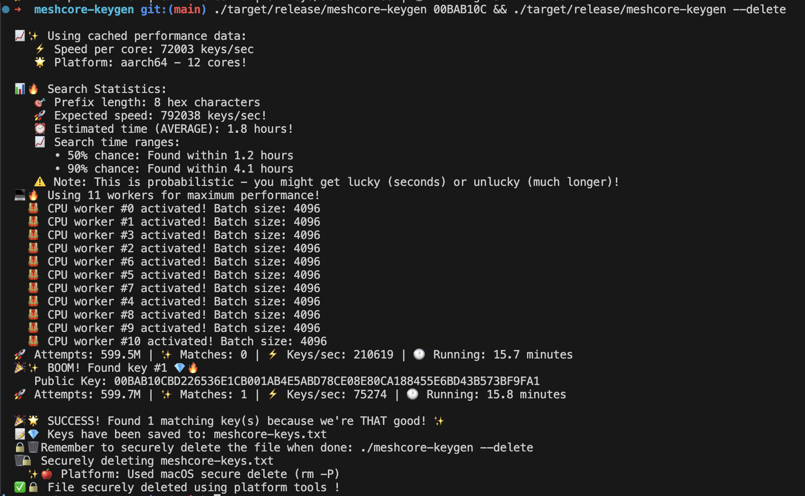

# 🔑✨ MeshCore Keygen

*When you absolutely, positively need your Ed25519 keys to start with "C0FFEE" using the sloppiest of AI slop 🤖.*

## What's This?

A blazingly fast vanity key generator for Ed25519 keys in meshcore format. Want a public key that starts with your initials? Your favorite hex word? Your cat's name in hex? We've got you covered.

## Features

⚡️ **Multi-threaded** - Uses all your cores (minus one for sanity)  
🔒 **Secure** - Proper Ed25519 key generation with secure memory handling  
📊 **Smart Estimates** - Shows you realistic time estimates (spoiler: longer patterns take *way* longer)  
💾 **Persistent Results** - Keys saved to `meshcore-keys.txt` so you don't lose your precious finds

## Quick Start

```bash
# Build it (release mode for maximum zoom)
cargo build --release

# Find a key starting with "CAFE"
./target/release/meshcore-keygen CAFE

# Find multiple keys (because one is never enough)
./target/release/meshcore-keygen BEEF --max-keys 5

# Find one key and call it a day
./target/release/meshcore-keygen DEAD --max-keys 1

# Delete'em all
./target/release/meshcore-keygen --delete
```

## Requirements

- Rust (obviously)
- Patience (for longer patterns)
- Coffee (not required but recommended)

## Output

Found keys land in `meshcore-keys.txt` with all the juicy details: private key; public key.



---

*"In cryptography we trust, but vanity we verify."*
